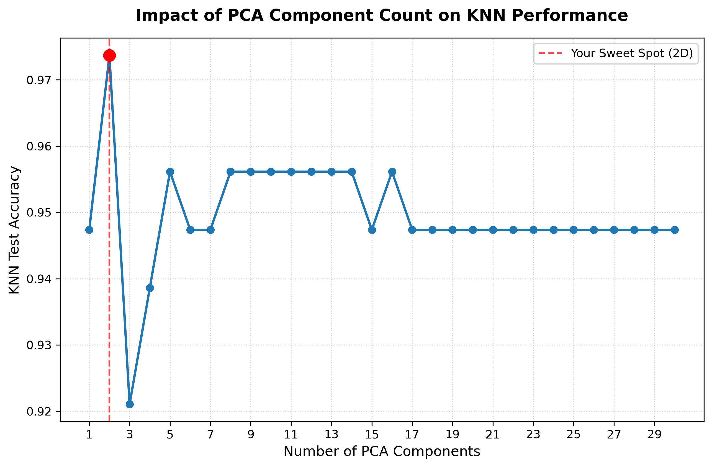

# Optimizing KNN Classification via Principal Component Analysis (PCA)

An empirical data science study demonstrating how dimensionality reduction tackles the **Curse of Dimensionality** on high-dimensional biomedical data. By compressing feature spaces using PCA, this project optimizes a K-Nearest Neighbors (KNN) model to classify malignant and benign tumors with higher precision and less structural noise.

---

## 📊 Performance Breakdown

| Feature Space | Dimensions | KNN Test Accuracy | Architectural Insight |
| :--- | :---: | :---: | :--- |
| **Raw Scaled Features (Baseline)** | 30 | **94.7%** | Suffers from multi-collinearity and spatial feature redundancy. |
| **PCA-Reduced Space (Optimal)** | **2** | **97.4%** | **Sweet Spot.** Noise filtered out; distance boundaries are crisp. |
| **PCA-Reduced Space** | 3 | **92.1%** | Performance drops as lower-variance axes introduce random background noise. |

---

## 📈 Key Empirical Insight

The optimization curve below maps KNN accuracy against the number of principal components retained. 



### Why 2D Beats 3D and 30D:
1. **Filtering the Noise:** The Breast Cancer dataset contains highly correlated measurements (e.g., radius, perimeter, area). In 30-dimensional space, KNN calculates spatial distances along redundant axes, weakening its neighborhood metrics.
2. **Variance Capture:** The first two principal components hold approximately **63% of the entire dataset's variance** ($PC1 \approx 43.5\%$, $PC2 \approx 19.5\%$). 
3. **The Noise Trap of PC3:** Forcing the distance model into a third dimension ($PC3$) only introduces a minor $9.7\%$ of variance, which consists mostly of uninformative sensor noise, actively degrading classification performance.

---

## 🛠️ Tech Stack & Methods
* **Language:** Python
* **Libraries:** Scikit-Learn, Pandas, NumPy, Matplotlib, Seaborn
* **Dimensionality Reduction:** Principal Component Analysis (PCA)
* **Supervised Learning:** K-Nearest Neighbors (KNN Classifier)
* **Data Pipelines:** Standardizing features using Z-score scaling (`StandardScaler`) to protect PCA coordinate transformations.

---

## 📁 Dataset Source

This project uses the **Breast Cancer Wisconsin (Diagnostic) Dataset**, which is natively bundled within `scikit-learn` via `sklearn.datasets.load_breast_cancer`. 

* **Features:** 30 numeric attributes computing characteristics of cell nuclei (e.g., radius, texture, perimeter, area, smoothness, concavity).
* **Target:** Binary Classification (`0: Malignant`, `1: Benign`).

---

## 🚀 Quick Start & Installation

1. **Clone the repository:**
   ```bash
   git clone [https://github.com/YOUR_USERNAME/pca-dimensional-optimization.git](https://github.com/YOUR_USERNAME/pca-dimensional-optimization.git)
   cd pca-dimensional-optimization

2. **Install dependencies:**
   ```bash
   pip install -r requirements.txt
   ```

---

## 💻 How to Run the Notebook

Once you have completed the installation, you can launch and explore the pipeline locally:

1. Start Jupyter Notebook in your terminal:
   ```bash
   jupyter notebook
   ```
2. Navigate to and open `pca_dimension_reduction_analysis.ipynb`.
3. Select **Kernel -> Restart & Run All** from the top menu to re-run the entire pipeline and re-generate the optimization plot automatically.

---
